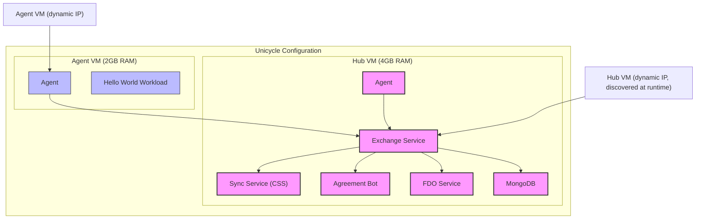
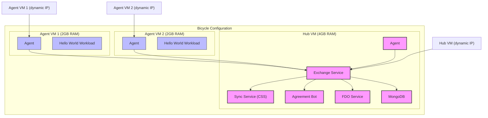
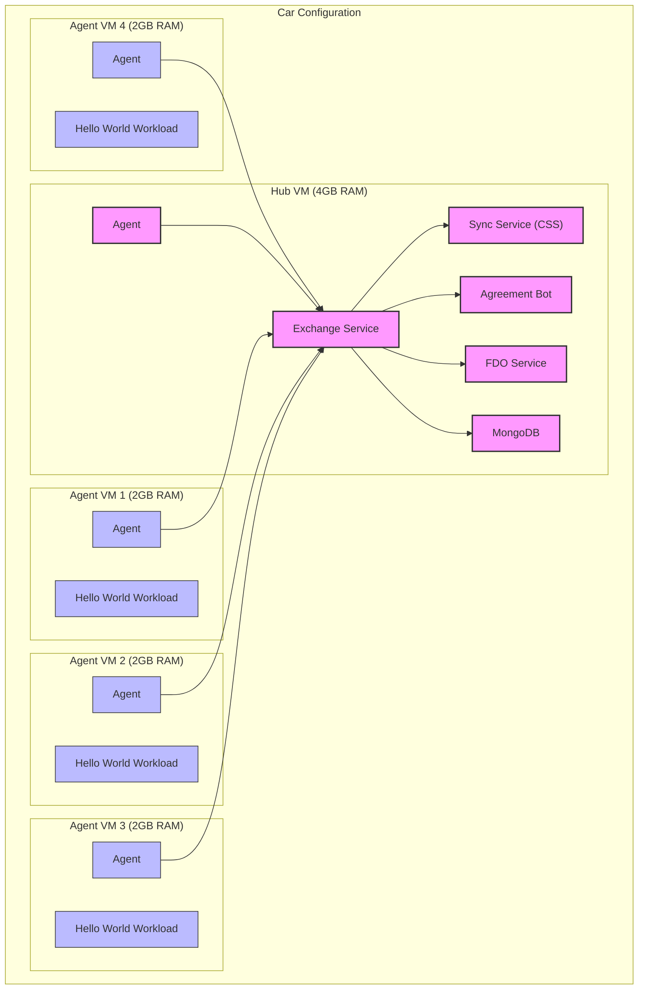
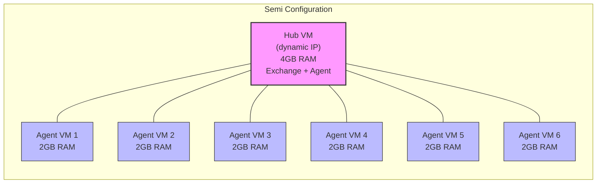
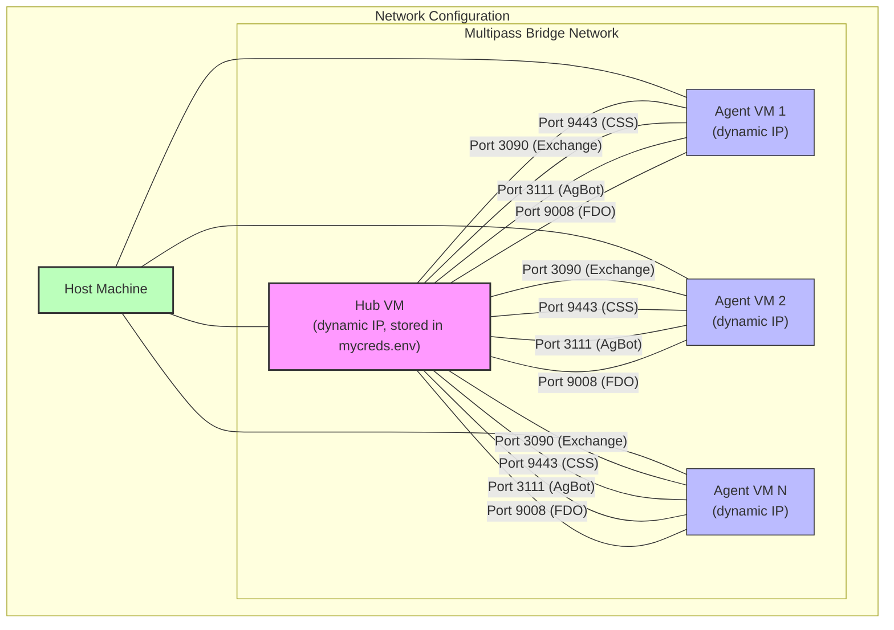

# demo-in-a-box

This is a set of materials designed to allow anyone to create a portable set of computers that will demonstrate most aspects of Open Horizon and OH-delivered applications in a single location. It should contain a Bill of Materials, initial configuration, setup instructions, and examples of how to demonstrate most features.

## Pre-requisites

### Required (All Installation Methods)

* `make`
* [`multipass`](https://multipass.run) ≥ 1.13 — lightweight VM manager (replaces Vagrant + VirtualBox)
* `jq` — JSON processor used for hub IP discovery
  - macOS: `brew install jq`
  - Linux: `sudo apt-get install jq` or `sudo snap install jq`

### System Requirements

* **Architecture:** `x86_64` or `arm64` (Apple Silicon supported)
* **OS:** macOS, Linux, or Windows (WSL2)
* **RAM:** 8 GB minimum (16 GB recommended for car/semi configurations)
* **Disk:** 20 GB minimum free
* **Multipass:** Install from [https://multipass.run](https://multipass.run)

> **Migrating from the Vagrant/VirtualBox branch?** See the [Migration Guide](#migration-from-vagrant--virtualbox) below.

## System Configurations

The host can be configured in one of four ways:

### Unicycle Configuration

Two VMs — one hub (4 GB RAM, Exchange/CSS/AgBot/FDO/MongoDB) and one agent VM (2 GB RAM, HelloWorld workload).



### Bicycle Configuration

Three VMs — one hub and two agent VMs.



### Car Configuration

Five VMs (requires 16 GB host RAM).



### Semi Configuration

Seven VMs (requires 16 GB host RAM).



### Network Configuration

VMs communicate over the Multipass bridge network. IPs are dynamically assigned by Multipass and stored in `mycreds.env` after `make up-hub`.



### Legend

- **Pink/Purple Nodes**: Hub VM components (Exchange, CSS, AgBot, FDO, MongoDB)
- **Blue Nodes**: Agent VM components
- **Green Node**: Host machine

## Blessed Samples

Demo-in-a-Box can automatically build and publish additional Open Horizon services during provisioning via the optional `blessedSamples.txt` file.

Create the file in the project root and list service repositories — one per line:
```
https://github.com/open-horizon-services/web-helloworld-python.git
https://github.com/open-horizon/examples.git master edge/services/helloworld
```

Services are cloned, built, pushed to a local container registry on the hub VM at port 5000, and published to the Exchange during `make up-hub`. A build summary is saved to `blessed-samples-build-latest.log`.

See [BLESSED_SAMPLES.md](BLESSED_SAMPLES.md) for full documentation, format reference, environment variables, and troubleshooting.

## Installation

Clone the repository, then `cd` into the repo folder.

### Standard Installation

```bash
# Verify prerequisites are installed
make check

# Provision hub VM (~20-40 minutes) and agent VM(s)
make init
```

`make init` runs `make up-hub` (launches hub, writes `mycreds.env`) then `make up` (launches agent VMs with cloud-init).

Installation time:
- **unicycle:** 30–45 minutes (cloud-init installs packages on first run)
- **semi:** 60–90 minutes

### Advanced Configuration

Customize with environment variables before `make init`:

#### Resource Configuration
* `NUM_AGENTS` — Number of agent VMs (default: 1)
* `MEMORY` — Memory per agent VM in MB (default: 2048)
* `DISK_SIZE` — Disk per agent VM in GB (default: 20)
* `MULTIPASS_IMAGE` — Ubuntu cloud image to use (default: `22.04`)
* `SYSTEM_CONFIGURATION` — Shortcut: `unicycle` | `bicycle` | `car` | `semi`

#### Custom Resource Example
```shell
export SYSTEM_CONFIGURATION=bicycle
export MEMORY=4096
export DISK_SIZE=40
make init
```

If you only want the hub running in a VM (no separate agent VMs), just run `make up-hub` instead of `make init`.

Running `make down` will de-provision all VMs and delete temporary files. This cannot be undone.

## Agent Configuration Files

After provisioning the hub VM, generate agent configuration files for connecting to the Open Horizon services from different network contexts:

```bash
make generate-agent-configs
```

This creates two configuration files:

### agent-install-external.env
Contains service URLs using your **host machine's local network IP address**. Use this when:
- Running an agent directly on your host machine
- Testing from the host where the VMs are running

**Example:**
```bash
export HZN_EXCHANGE_URL=http://192.168.1.100:3090/v1
export HZN_FSS_CSSURL=http://192.168.1.100:9443/
export HZN_AGBOT_URL=http://192.168.1.100:3111
export HZN_FDO_SVC_URL=http://192.168.1.100:9008/api
```

### agent-install-internal.env
Contains service URLs using the **hub VM's Multipass IP** (sourced from `mycreds.env`). Use this when:
- Running an agent inside another VM on the same Multipass bridge
- Connecting from agent VMs to the hub VM

**Example:**
```bash
export HZN_EXCHANGE_URL=http://192.168.64.10:3090/v1
export HZN_FSS_CSSURL=http://192.168.64.10:9443/
export HZN_AGBOT_URL=http://192.168.64.10:3111
export HZN_FDO_SVC_URL=http://192.168.64.10:9008/api
```

### Using the Configuration Files

```bash
# Load external configuration (for host machine)
export $(cat agent-install-external.env)
hzn version

# Or load internal configuration (for VM agents)
export $(cat agent-install-internal.env)
hzn node list
```

### Additional Commands

```bash
# Check your host machine's detected IP address
make check-host-ip

# Regenerate external config only (if your host IP changed)
make agent-config-external

# Regenerate internal config only (if the hub IP changed)
make agent-config-internal
```

**Note:** To expose hub service ports on `localhost`, use `make port-forward` after `make up-hub`. This is the replacement for the Vagrant `forwarded_port` behaviour.

## Usage

Run `make connect` to open a shell on the first agent VM. For other VMs, specify the VM name: `make connect VMNAME=agent3`.

To test the installation:

```shell
hzn version
```

Should return matching version numbers for the CLI and agent.

```shell
hzn node list
```

Shows the agent running with the HelloWorld workload configured.

```shell
hzn agreement list
```

Shows active agreements between the agent and AgBot.

```shell
hzn ex user ls
```

Confirms CLI connectivity to the Exchange.

```shell
hzn ex node ls
```

Shows all agents registered with the Exchange.

```shell
exit
```

Disconnects from the VM shell.

```shell
make down
```

Destroys all VMs and removes generated files.

## Advanced Details

### IP Addressing Scheme

Under Multipass, VM IPs are dynamically assigned by the Multipass bridge DHCP (typically `192.168.64.x` on macOS, `10.118.x.x` on Linux). After `make up-hub` completes:

- The hub IP is discovered via `multipass info hub --format json`
- It is stored as `export HUB_IP=<ip>` in `mycreds.env`
- All agent VMs receive the hub IP at launch time via their cloud-init config

There is no fixed IP scheme. Re-running `make up-hub` will re-discover and re-write the IP in `mycreds.env`.

### Resource Allocation

Default per-VM allocation:
- **Hub:** 4 GB RAM, 50 GB disk, 2 vCPUs
- **Agents:** 2 GB RAM, 20 GB disk, 1 vCPU

Customize with `MEMORY`, `DISK_SIZE`, and `MULTIPASS_IMAGE` environment variables.

## Migration from Vagrant + VirtualBox

If you are upgrading from the Vagrant/VirtualBox-based branch:

1. **Destroy existing VMs** (on the old branch):
   ```bash
   make down
   ```

2. **Uninstall Vagrant and VirtualBox** (optional, but frees disk space):
   ```bash
   # macOS
   brew uninstall vagrant
   # Remove VirtualBox via its uninstaller
   ```

3. **Install Multipass** from [https://multipass.run](https://multipass.run)

4. **Install `jq`:**
   ```bash
   brew install jq          # macOS
   sudo apt-get install jq  # Linux
   ```

5. **Check out this branch** and verify prerequisites:
   ```bash
   make check
   ```

6. **Provision as normal:**
   ```bash
   make init
   ```

**What changed:**
- `Vagrantfile.hub` and `Vagrantfile.template.erb` → replaced by `cloud-init/hub.yaml` and `cloud-init/agent.yaml.template`
- `packer/` and `build-custom-box.sh` → removed (no box build step needed)
- Fixed `192.168.56.x` network → dynamic IPs assigned by Multipass, stored in `mycreds.env`
- `vagrant ssh` → `multipass shell`
- `vagrant destroy` → `multipass delete --purge`
- `BOX_VERSION`, `HUB_OS_TYPE`, `AGENT_OS_TYPE` variables → removed
- Only Ubuntu 22.04 is supported in this release; multi-OS support will be added in a future change
