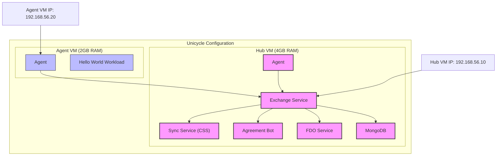
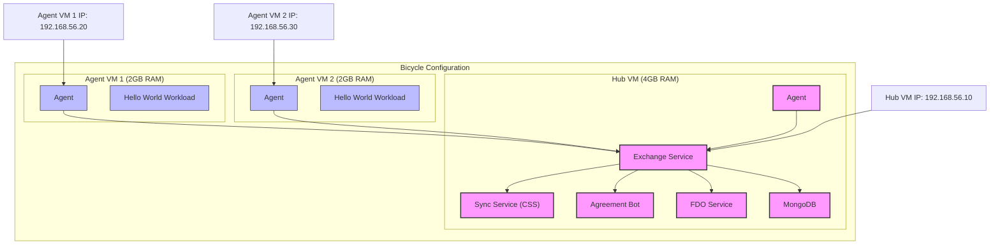
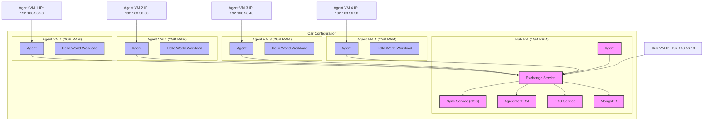
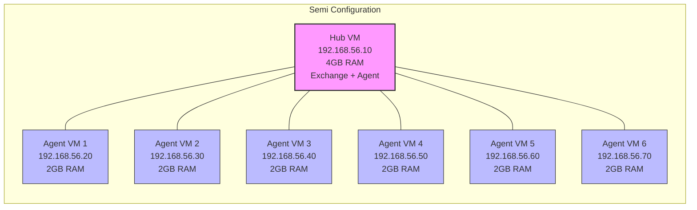
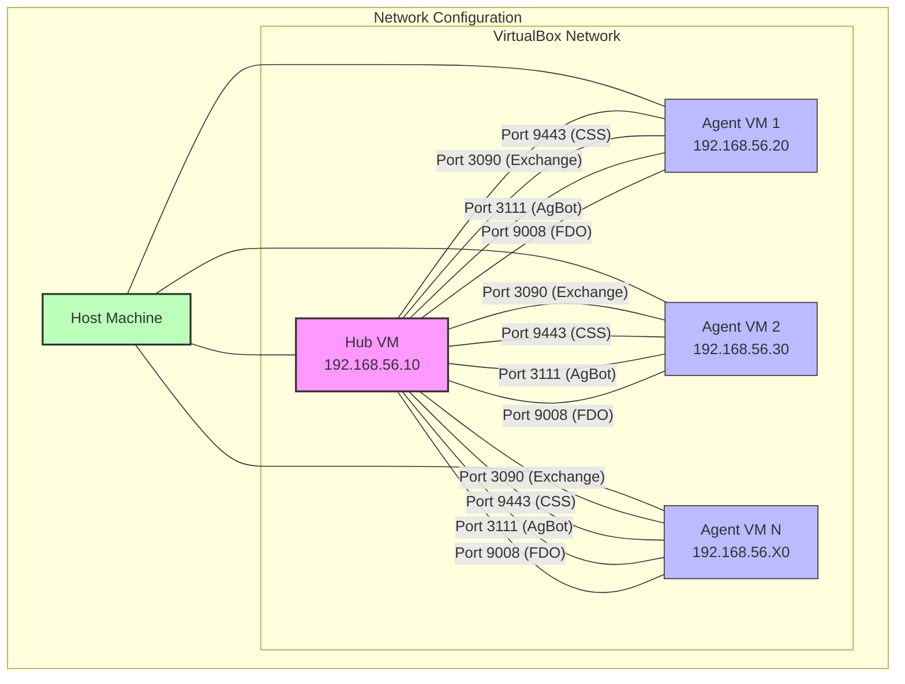

# Architecture Diagrams Plan for demo-in-a-box

## Overview

This document outlines the plan for creating visual diagrams to enhance the README.md file. These diagrams will illustrate the different system configurations (unicycle, bicycle, car, and semi) and clearly show the relationships between VMs, network connections, and Open Horizon components.

## Diagram Requirements

Each diagram should include:

1. Visual representation of all VMs in the configuration
2. Clear labeling of the hub VM (with Exchange) and agent VMs
3. IP addresses for each VM
4. Memory allocation for each VM
5. Network connections between VMs
6. Open Horizon components running on each VM

## Implementation Approach

We will use Mermaid diagrams embedded directly in the README.md file. Mermaid is supported by GitHub and will render as visual diagrams when viewed on GitHub.

## Diagram Drafts

### 1. Unicycle Configuration (2 VMs)

### 2. Bicycle Configuration (3 VMs)

### 3. Car Configuration (5 VMs)

### 4. Semi Configuration (7 VMs)

```mermaid
graph TD
    subgraph "Semi Configuration"
    
    subgraph "Hub VM (4GB RAM)"
    Exchange["Exchange Service"]
    CSS["Sync Service (CSS)"]
    AgBot["Agreement Bot"]
    FDO["FDO Service"]
    MongoDB["MongoDB"]
    HubAgent["Agent"]
    end
    
    subgraph "Agent VM 1 (2GB RAM)"
    Agent1["Agent"]
    HelloWorld1["Hello World Workload"]
    end
    
    subgraph "Agent VM 2 (2GB RAM)"
    Agent2["Agent"]
    HelloWorld2["Hello World Workload"]
    end
    
    subgraph "Agent VM 3 (2GB RAM)"
    Agent3["Agent"]
    HelloWorld3["Hello World Workload"]
    end
    
    subgraph "Agent VM 4 (2GB RAM)"
    Agent4["Agent"]
    HelloWorld4["Hello World Workload"]
    end
    
    subgraph "Agent VM 5 (2GB RAM)"
    Agent5["Agent"]
    HelloWorld5["Hello World Workload"]
    end
    
    subgraph "Agent VM 6 (2GB RAM)"
    Agent6["Agent"]
    HelloWorld6["Hello World Workload"]
    end
    
    Exchange --> CSS
    Exchange --> AgBot
    Exchange --> FDO
    Exchange --> MongoDB
    
    Agent1 --> Exchange
    Agent2 --> Exchange
    Agent3 --> Exchange
    Agent4 --> Exchange
    Agent5 --> Exchange
    Agent6 --> Exchange
    HubAgent --> Exchange
    
    classDef hub fill:#f9f,stroke:#333,stroke-width:2px
    classDef agent fill:#bbf,stroke:#333,stroke-width:1px
    class Exchange,CSS,AgBot,FDO,MongoDB,HubAgent hub
    class Agent1,HelloWorld1,Agent2,HelloWorld2,Agent3,HelloWorld3,Agent4,HelloWorld4,Agent5,HelloWorld5,Agent6,HelloWorld6 agent
    
    end
    
    IP1["Hub VM IP: 192.168.56.10"] --> Exchange
    IP2["Agent VM 1 IP: 192.168.56.20"] --> Agent1
    IP3["Agent VM 2 IP: 192.168.56.30"] --> Agent2
    IP4["Agent VM 3 IP: 192.168.56.40"] --> Agent3
    IP5["Agent VM 4 IP: 192.168.56.50"] --> Agent4
    IP6["Agent VM 5 IP: 192.168.56.60"] --> Agent5
    IP7["Agent VM 6 IP: 192.168.56.70"] --> Agent6
```

## Alternative Diagram Style

If the above style becomes too complex for larger configurations, we could use a simpler style:

## Network Diagram

We should also include a network diagram showing how the VMs are connected:

## Implementation Steps

1. Create a new branch for the documentation updates
2. Add the diagrams to the README.md file in the appropriate sections
3. Update the System Configurations section to include the diagrams
4. Add a legend explaining the symbols and colors used in the diagrams
5. Submit a pull request for review

## Next Steps

After implementing these diagrams, we should:

1. Get feedback from users on the clarity and usefulness of the diagrams
2. Consider adding additional diagrams for specific workflows or use cases
3. Update the diagrams as needed based on feedback and changes to the project